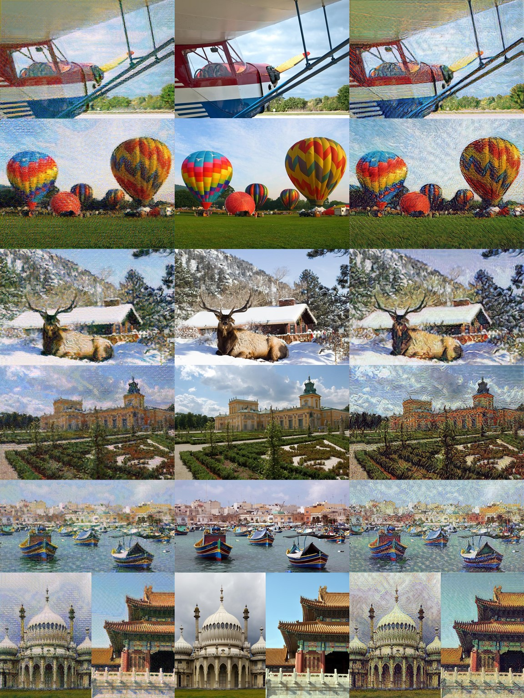

# Adaptive Style Transfer - Pytorch

This is my own implementation of the ECCV 2018 paper 'A Style-Aware Content Loss for Real-time HD Style Transfer' based on pytorch. All credits should be given to the authors of the original paper. Here are links to their [website](https://compvis.github.io/adaptive-style-transfer) and [github repository](https://github.com/CompVis/adaptive-style-transfer). My own implementation is meant for research use only. Please use at your own risk.

## Some Results (self-trained)
From left to right: Monet style results, original photos, Vangogh style results


## Requirements

* Python 3
* Pytorch
* PIL, numpy, scipy
* tqdm, yaml
* cv2, tensorboardX (only for training)

I used python 3.6 and pytorch 1.0 to develop the code and tested it on a Windows PC with an Nvidia GTX 980 Ti. Different platform may need changes on the code.

## Get Started

.yaml file is used to configure the network. An example is provided in the repository at ./configs/vangogh.yaml.

### Testing

We provide 2 trained generators ([Vangogh generator](https://drive.google.com/file/d/1QNSS3uNaHhmMowRnYlR2NKlBZXMQfF6v/view?usp=sharing) and [Monet generator](https://drive.google.com/file/d/1AYQ6couzHicjhFKCgz48G7NipruW5VOF/view?usp=sharing)) for quick testing.

Example testing script:

```
python test.py --config=./configs/vangogh.yaml \
--trained_network=./gen_test.pt \
--input_path=./inputs \
--output_path=./outputs
```
* --config is the path to the .yaml file.
* --trained_network is the path to the trained generator (including encoder and decoder).
* --input_path is the directory of images to test.
* --output_path is the directory for output.

When testing, make sure to use the same .yaml file as the training process, since both the image size and the network size are determined in this file.

### Training

Please check out the original paper for training details first.

Content images used for training: [Places365-Standard high-res train mages (105GB)](http://data.csail.mit.edu/places/places365/train_large_places365standard.tar). 

Style images used for training: [download link](https://hcicloud.iwr.uni-heidelberg.de/index.php/s/NcJj2oLBTYuT1tf).

To train, modify the .yaml to set the desired network size, training parameters, data paths and weights in loss functions. Then, use the blow script to start training:

```
python train.py --config=./configs/vangogh.yaml \
--output_path=./outputs
```
* --config is the path to the .yaml file.
* --output_path (optional) is the directory for output. By default, the root directory of the rpository is used.

To resume training, use:

```
python train.py --config=./configs/vangogh.yaml \
--output_path=./outputs
--resume
```